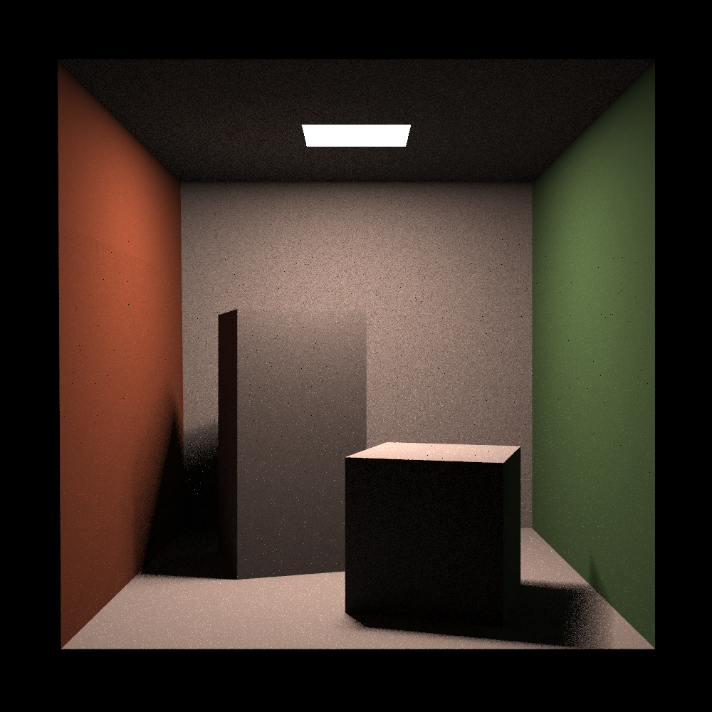
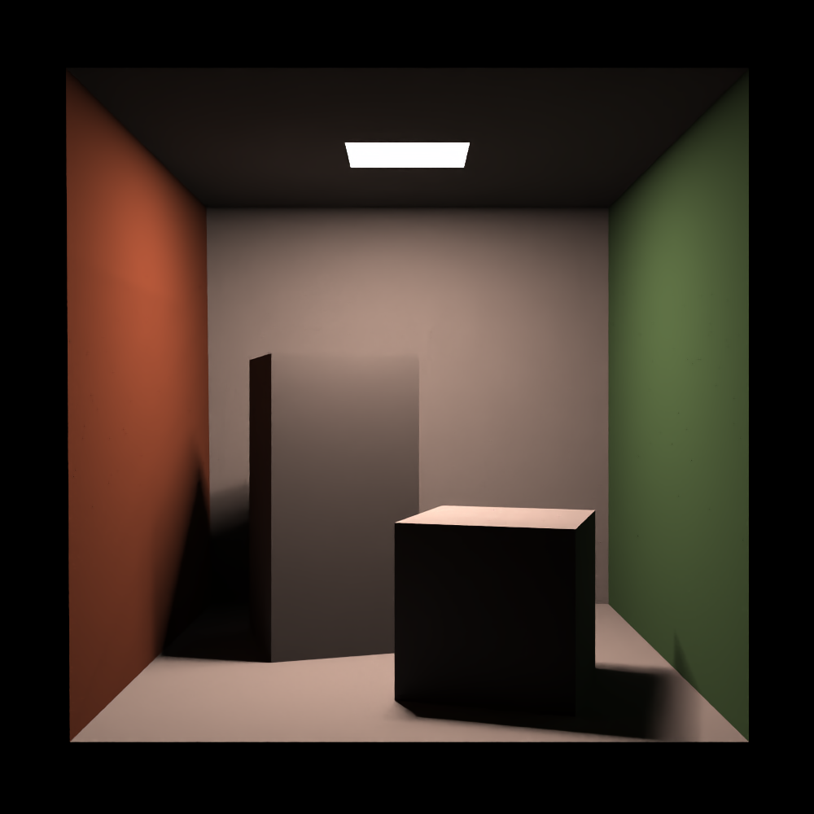

# OIDN-python
Python Binding of [Intel Open Image Denoise](https://github.com/OpenImageDenoise/oidn) Version 0.4 (Based on OIDN 2.1.0, **NOT FINISHED**)

Install using pip.(support macos_aarch64, win_amd64, linux_x64).

```
pip install oidn
```

# Features(version 0.4)

## C API wrapper

- Wrap original OIDN C APIs using ctypes. functions are stripped oidn prefix, macros are stripped OIDN_ prefix. For example oidnNewDevice -> oidn.NewDevice, OIDN_FORMAT_FLOAT3 -> oidn.FORMAT_FLOAT3. 

- Discard buffer APIs, use numpy array as buffers.

## Object-Oriented Interface

OOP style interface will be finished in version 1.0

# Example denoising image

Denoise image rendered by a monte carlo ray tracer. [code](./tests/DenoiseCornellBox/DenoiseCornellBox.py)

```python 
from pathlib import Path
import sys
import numpy as np
from PIL import Image

here = Path(__file__).parent.absolute()
sys.path.append(here.parent.parent.absolute().as_posix())

import oidn

img = np.array(Image.open((here / "CornellBoxNoisy.png").as_posix()), dtype=np.float32) / 255.0

result = np.zeros_like(img, dtype=np.float32)

device = oidn.NewDevice()
oidn.CommitDevice(device)

filter = oidn.NewFilter(device, "RT")
oidn.SetSharedFilterImage(
    filter, "color", img, oidn.FORMAT_FLOAT3, img.shape[1], img.shape[0]
)
oidn.SetSharedFilterImage(
    filter, "output", result, oidn.FORMAT_FLOAT3, img.shape[1], img.shape[0]
)
oidn.CommitFilter(filter)
oidn.ExecuteFilter(filter)

result = np.array(np.clip(result * 255, 0, 255), dtype=np.uint8)
resultImage = Image.fromarray(result)
resultImage.save(f"{here}/CornellBoxDenoised.png")

oidn.ReleaseFilter(filter)
oidn.ReleaseDevice(device)
```

The image in left is before denoised, rendered by a Monte-Carlo PathTracer, spp=10, width=height=1000. The image in right is after denoised.

<div>
<div style="width:48%; display: inline-block"> 

</div>
<div style="width:48%; display: inline-block"> 

</div>
</div>

# Pending Features
- Support for SYCL and HIP devices.
- Asynchronized executing/buffering APIs.
- OOP and pythonic style interfaces (**Not** bindings of original OIDN C++ APIs). 

# Update Log
- 0.4 : CUDA device is supported now, torch.Tensor and cupy.ndarray could be passed as GPU buffers. Torch and CUPY are counted into optional dependencies.
- 0.3.1alpha : Update to new oidn version 2.1.0. Only CPU device is supported at the moment.
- 0.3alpha : Warp nearly full APIs of OIDN1.4.3 in oidn.h. (excluding buffer APIs, buffers are substituted numpy array), add function \_\_doc\_\_, to be comprehensively test.
- 0.2.1 : Support win_amd64 and manylinux1_x86_64 platform.
- 0.2 : Wrap basic device and filter APIs, Initial support for macosx_12_0_arm64 platform.
